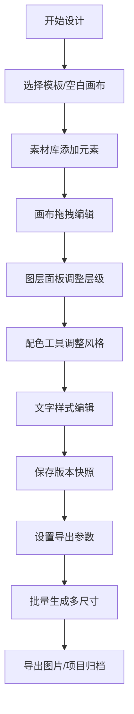

## 1. 产品概述

Design Studio 是一款面向海报和社交媒体图形设计者的创意设计桌面应用。用户可从模板开始设计，通过拖拽元素、调整样式、配色搭配快速创作出专业级设计作品，并支持批量生成多平台尺寸。

- 核心价值：降低设计门槛，提升创作效率，一站式完成从模板选择到多平台导出的完整设计流程
- 目标用户：自媒体运营者、电商设计师、市场专员、非专业设计爱好者

## 2. 核心功能

### 2.1 功能模块

1. **素材库**：模板选择、图片素材、形状元素、图标库
2. **画布编辑**：画布尺寸切换、元素拖拽、对齐吸附、缩放平移
3. **图层面板**：图层排序、显隐控制、锁定、分组、重命名
4. **文字样式**：字体选择、字号字重、描边阴影、行高字距
5. **配色工具**：配色推荐、色板收藏、取色器、渐变色
6. **导出中心**：多尺寸生成、批量导出、格式选择、质量调节
7. **项目管理**：版本快照、项目归档、批量替换文字、模板保存

### 2.2 页面详情

| 页面名称 | 模块名称 | 功能描述 |
|---------|---------|----------|
| 编辑器主界面 | 左侧素材面板 | 模板库、图片素材、形状、文字工具切换 |
| 编辑器主界面 | 中央画布区 | 画布编辑、元素操作、缩放控制、标尺网格 |
| 编辑器主界面 | 右侧属性面板 | 图层列表、属性调整、样式编辑 |
| 编辑器主界面 | 顶部工具栏 | 撤销重做、缩放比例、画布尺寸、导出入口 |
| 导出中心 | 导出配置 | 格式选择、质量调节、多尺寸勾选、批量导出 |
| 项目管理 | 项目列表 | 项目缩略图、版本快照、归档恢复、模板保存 |

## 3. 核心流程

### 3.1 设计创作流程

用户打开应用 → 选择模板或空白画布 → 从素材库添加元素 → 在画布上拖拽调整 → 通过图层面板管理层级 → 使用配色工具调整风格 → 添加并编辑文字 → 保存版本快照 → 选择导出尺寸 → 批量导出图片

### 3.2 流程图

## 4. 用户界面设计

### 4.1 设计风格

- **主色调**：深紫蓝色系 (#4F46E5) 作为品牌主色，搭配深灰背景打造专业创意工具氛围
- **辅助色**：青色 (#06B6D4) 用于交互高亮，珊瑚粉 (#F43F5E) 用于强调操作
- **背景**：深色模式为主，采用 #18181B 至 #27272A 的渐变层次，减少视觉疲劳
- **字体**：展示字体使用 Space Grotesk，正文使用 Inter，等宽字体使用 JetBrains Mono
- **按钮风格**：微圆角 (6px)，微妙阴影，悬停时有轻微上浮和发光效果
- **布局风格**：三栏式专业工具布局，左中右面板可折叠，画布区居中带阴影投影
- **图标风格**：线性图标，1.5px 描边，统一使用 lucide-react

### 4.2 页面设计概览

| 页面名称 | 模块名称 | UI 元素 |
|---------|---------|---------|
| 编辑器主界面 | 左侧面板 | 标签切换、素材网格、搜索框、分类筛选 |
| 编辑器主界面 | 画布区域 | 带投影画布、标尺、缩放控件、网格开关 |
| 编辑器主界面 | 右侧面板 | 图层列表、属性表单、滑块控件、颜色选择器 |
| 编辑器主界面 | 顶部工具栏 | Logo、操作按钮组、缩放比例、尺寸显示、导出按钮 |
| 导出中心 | 导出弹窗 | 尺寸卡片网格、格式单选、质量滑块、导出进度条 |
| 项目管理 | 侧边抽屉 | 项目卡片、版本时间线、操作菜单 |

### 4.3 响应式

- 桌面端优先设计，最低支持 1280px 宽度
- 面板支持拖拽调整宽度和折叠收起
- 画布区域自适应剩余空间
- 弹窗和对话框居中显示，支持 ESC 关闭

### 4.4 交互动效

- 元素拖拽时带吸附高亮和智能参考线
- 图层排序有平滑过渡动画
- 面板展开/收起有缓动过渡
- 按钮和可点击元素有微缩放反馈
- 导出进度有动画指示器
