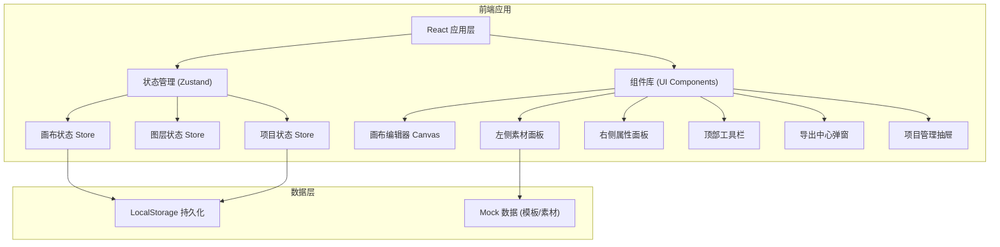

## 1. 架构设计



## 2. 技术描述

- **前端框架**：React@18 + TypeScript
- **构建工具**：Vite@5
- **样式方案**：TailwindCSS@3 + CSS 变量
- **状态管理**：Zustand
- **图标库**：lucide-react
- **画布渲染**：HTML5 Canvas + DOM 元素混合方案
- **拖拽库**：原生实现 (react-dnd 备选)
- **导出功能**：html-to-image + Canvas API
- **数据持久化**：LocalStorage
- **路由**：react-router-dom

## 3. 目录结构

```
src/
├── components/
│   ├── canvas/          # 画布编辑器相关
│   │   ├── Canvas.tsx
│   │   ├── CanvasElement.tsx
│   │   └── ZoomControls.tsx
│   ├── panels/          # 面板组件
│   │   ├── LeftPanel/   # 左侧素材面板
│   │   ├── RightPanel/  # 右侧属性面板
│   │   └── Toolbar/     # 顶部工具栏
│   ├── common/          # 通用组件
│   │   ├── Button.tsx
│   │   ├── Slider.tsx
│   │   ├── ColorPicker.tsx
│   │   └── Modal.tsx
│   └── modals/          # 弹窗组件
│       ├── ExportModal.tsx
│       └── ProjectDrawer.tsx
├── store/               # Zustand 状态管理
│   ├── canvasStore.ts
│   ├── layerStore.ts
│   └── projectStore.ts
├── hooks/               # 自定义 Hooks
│   ├── useDrag.ts
│   ├── useCanvasZoom.ts
│   └── useLocalStorage.ts
├── utils/               # 工具函数
│   ├── canvas.ts
│   ├── color.ts
│   ├── export.ts
│   └── templates.ts
├── types/               # TypeScript 类型定义
│   ├── canvas.ts
│   ├── layer.ts
│   └── project.ts
├── data/                # Mock 数据
│   ├── templates.ts
│   ├── materials.ts
│   └── colorPalettes.ts
├── pages/               # 页面
│   └── Editor.tsx
├── App.tsx
├── main.tsx
└── index.css
```

## 4. 状态管理设计

### 4.1 Canvas Store
- 画布尺寸、缩放比例、偏移量
- 选中元素 ID 列表
- 历史记录栈 (撤销/重做)

### 4.2 Layer Store
- 图层列表 (数组，按 z-index 排序)
- 当前选中图层
- 图层操作方法 (添加、删除、移动、排序)

### 4.3 Project Store
- 当前项目信息
- 版本快照列表
- 模板数据

## 5. 核心数据模型

### 5.1 图层元素类型

```typescript
interface BaseLayer {
  id: string;
  type: 'image' | 'text' | 'shape' | 'template';
  name: string;
  x: number;
  y: number;
  width: number;
  height: number;
  rotation: number;
  opacity: number;
  visible: boolean;
  locked: boolean;
  zIndex: number;
}

interface ImageLayer extends BaseLayer {
  type: 'image';
  src: string;
  filter?: {
    brightness: number;
    contrast: number;
    saturate: number;
  };
}

interface TextLayer extends BaseLayer {
  type: 'text';
  content: string;
  fontSize: number;
  fontFamily: string;
  fontWeight: number;
  color: string;
  textAlign: 'left' | 'center' | 'right';
  lineHeight: number;
  letterSpacing: number;
  stroke?: {
    color: string;
    width: number;
  };
  shadow?: {
    color: string;
    offsetX: number;
    offsetY: number;
    blur: number;
  };
}

interface ShapeLayer extends BaseLayer {
  type: 'shape';
  shapeType: 'rectangle' | 'circle' | 'triangle' | 'line';
  fill: string;
  stroke?: {
    color: string;
    width: number;
  };
  borderRadius?: number;
}
```

### 5.2 画布尺寸预设

```typescript
interface CanvasSize {
  id: string;
  name: string;
  width: number;
  height: number;
  platform: string;
}
```

## 6. 功能实现策略

### 6.1 画布编辑
- 使用 CSS transform 实现画布缩放平移
- 元素定位使用绝对定位 + transform
- 拖拽使用原生 mousedown/mousemove/mouseup
- 对齐吸附通过计算元素边界距离实现

### 6.2 导出功能
- 使用 html-to-image 将 DOM 画布转为图片
- 支持 PNG、JPG、WebP 格式
- 多尺寸导出通过调整画布尺寸后逐张生成

### 6.3 背景移除
- 使用前端模拟实现 (提供预设去背图片素材)
- 预留 API 接口，可后续接入真实 AI 去背服务

### 6.4 数据持久化
- 项目数据存储在 LocalStorage
- 版本快照使用 JSON 序列化
- 图片素材使用 base64 或 URL 存储
```
